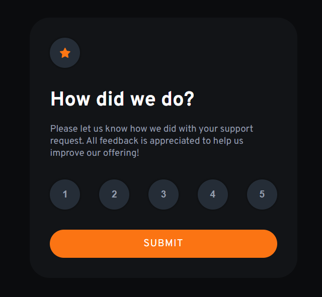

# Frontend Mentor - Interactive rating component solution

This is a solution to the [Interactive rating component challenge on Frontend Mentor](https://www.frontendmentor.io/challenges/interactive-rating-component-koxpeBUmI). Frontend Mentor challenges help you improve your coding skills by building realistic projects.

## Table of contents

- [Overview](#overview)
  - [The challenge](#the-challenge)
  - [Screenshot](#screenshot)
  - [Links](#links)
- [My process](#my-process)
  - [Built with](#built-with)
  - [Continued development](#continued-development)
- [Author](#author)

## Overview

### The challenge

Users should be able to:

- View the optimal layout for the app depending on their device's screen size
- See hover states for all interactive elements on the page
- Select and submit a number rating
- See the "Thank you" card state after submitting a rating

### Screenshots

### Links

- Solution URL: [Add solution URL here](https://your-solution-url.com)

## My process

### Built with

- HTML
- CSS
- Flexbox
- JavaScript
- Desktop-first workflow

### Continued development

Going forward, I shall focus on writing more semantically accurate HTML and meaningful naming of CSS classes. I noticed that deciding some classnames proved difficult.
Also, more commenting can't hurt 😂

## Author

- YouTube - [Anchor Coding](https://www.youtube.com/channel/UCPmdgwa3zes0eFtPJdbh1LA)
- Frontend Mentor - [@yourusername](https://www.frontendmentor.io/profile/yourusername)
